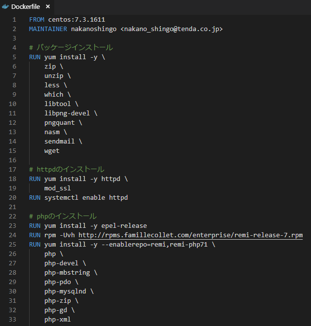
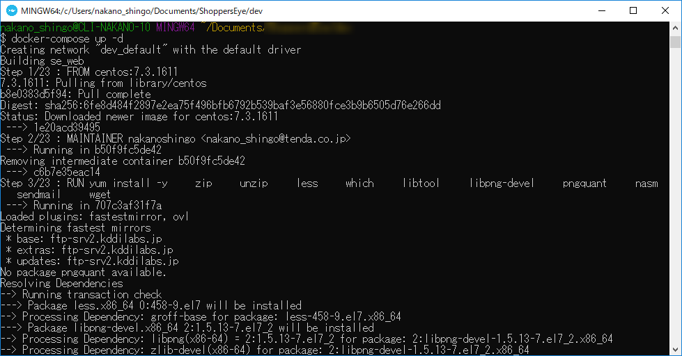

# Dockerのススメ
株式会社テンダ　ISJシステム開発1部  
中野 伸吾
---
# 自己紹介
- 名前：中野伸吾（なかのしんご）
- 2015年にテンダに新卒入社（4年目）
- Nuxt.js+Vuex / Flutterの勉強中 

---
# Docker 使ってますか？
--
# Dockerとは
- ** インフラのコード化 ** による 環境構築の自動化を実現するツール

- コンテナ型の仮想技術によって  ** どこでも同じように動作する環境 ** が実現できる

- ** 軽量な動作と環境ファイル共有 ** が可能
--
# Dockerのメリット
- 環境差分を無くせる (同じ環境を簡単に再現可)

- CI/CDツールとの連携が用意 
※ 開発･テスト･運用のサイクルを加速できる

- `docker-compose`や`オーケストレーションツール`による **複数コンテナの管理** が便利＋手軽

--
# Dockerのデメリット
**そ ん な も の は あ り ま せ ん**
--
強いて言うならば
- 学習コストがかかる
- OSを完全にエミュレートできない

---
# Dockerの導入方法
--
## ①Dockerクライアントの用意

|OS|利用ツール|
|---|---|
| Windows7 | <a href="https://docs.docker.com/toolbox/toolbox_install_windows/">Docker ToolBox</a> |
| Windows10 | <a href="https://docs.docker.com/docker-for-windows/">Docker for Windows</a> |
| MacOS | <a href="https://docs.docker.com/docker-for-mac/">Docker for Mac</a> |
--
## ②Dockerfileの用意

--
## ③Docker RUN!!!

---
# 今後について
--
## 導入実績を増やして ノウハウ/ナレッジを貯める
--
## オーケストレーションツールの検証／導入を行う
---
テンダでは、Dockerを使って Webアプリを開発しています

<a href="http://recruit.tenda.co.jp/">興味のある方は、一緒に働いてみませんか？</a>
---
# おわり
ありがとうございました。